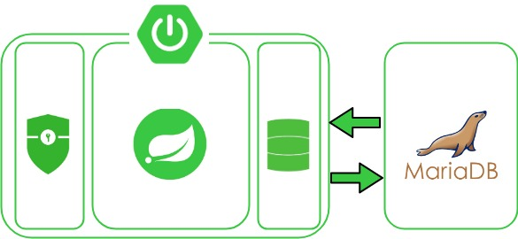

## 0. INTRO
스프링 부트 기반 REST API 만들기  
기간 : 7.8~7.31

## 1. 아키텍처

## 2. 기술스택

- Spirng Web MVC + Spring Boot
- Auth : Spring Boot Security + OAuth2 + Redis
- ORM : Spring Data JPA
- DB : MariaDB

## 3. 추가

- 배포 : Docker + GCP
- 운영 : Actuator
- CI/CD : Spring Batch + Jenkins